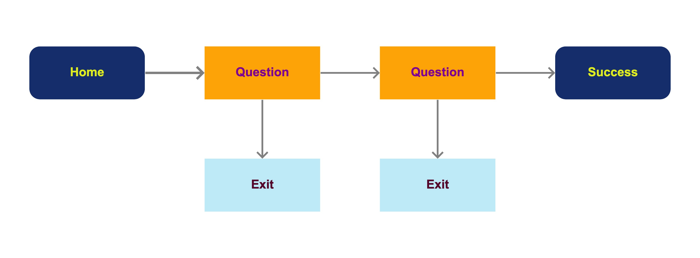

# USWDS Screener Prototyping Tool

At [Bixal](https://www.bixal.com/), we believe fast cycles of prototyping and testing accelerate learning, reduce risk, and improve outcomes. We started a dedicated internal team to explore new processes and tools for using web-based prototyping to help our delivery teams lower the barriers to making ideas more tangible more quickly. With our focus on speed, tangibility, reusability, and openness, we demonstrate what's possible with rapid prototyping, lean research, content libraries, and design frameworks. 

One issue we see commonly across government websites is the need for people to fill out a simple screener form before they continue with a larger task to ensure they understand what’s being asked of them and why. When these screeners are long, onerous, and confusing, they lead to wasted time and bad data. Our goal was to build a template that incorporates best practices for accessibility, plain language, and usability to make it quick and easy to test different versions.

## Features

- **Custom questions**: Set up any number of questions with their own answer text, related resources, and pathing based on responses. (Radio buttons only for now.)
- **Simple logic flow**: For each answer, direct people to the next question, an exit page, or jump ahead to the success page.
- **Linked resources**: Each question and exit page can include resource content stored in its own plain-text pages.
- **Step indicator**: Show people where they are in the process, even if you're not building the whole thing.
- **No code**: Most customization can be done by creating and editing plain-text files. No need to mess with code for the included features.
- **U.S. Web Design System**: Built on [USWDS](https://designsystem.digital.gov/) for the best in accessible, responsive, usable web experiences for government-focused sites.

## Content types

The screener includes the following content types:

- **Home**: The starting page to set context for your screener.
- **Question**: A single-question page template.
- **Exit**: Pages to direct people who filter out of the screener based on their responses.
- **Success**: The final page for people who have made it through the screener.

## Flow map

This is how the basic logic flow works:

## How to

### Getting started

1. If you don't have one, create a GitHub account.
1. On the repo homepage, press the `Use this template` button.
1. Finish creating your copy of the repo.

### Going live using GitHub Pages

GitHub Pages will compile and host your site automatically. You just need to enable the feature. Do this first so you can see your changes in the browser without having to run the site locally.

1. Go to the `Settings` tab.
1. Go to `Pages` in the side navigation.
1. In the `Source` section, set the branch to `main` and press Save.

It takes a few seconds to go live. After that you can see any changes you make to the branch at the URL provided, usually within a few seconds.

> *Tip*: Copy the Pages URL and add it to your repo About section for easy access.

### Configuring settings

You'll want to change the following settings in the config file ([_config.yml](_config.yml)):

- Title: The title of the site that shows up in the browser tab and on the homepage.
- Description: The description that shows up on the homepage and also the meta description for search engine optimization.
- **Baseurl: This needs to match the name of your repo for internal links to work.**

### Editing questions

1. Click on a question file in the `Code` tab.
1. Press the `Edit this file` button (pencil icon).
1. Make changes to the question settings.
1. Save your changes by pressing the `Commit changes` button.

> *Tip*: Add a short description about the change you made before committing.

> *Pro tip*: To use the version control features of GitHub for trying alternate versions of your screener, you can save changes to different "branch" and move them to the main branch later.

### Editing rich text content

Content for the home page, exit pages, and resource pages is stored in Markdown format. This is a simple way to structure and format content that is both human- and machine-readable.

You can open, edit, and save these pages the same way as questions.

See the GitHub Guide, [Mastering Markdown](https://guides.github.com/features/mastering-markdown/) for a reference on how to format content.

### Creating new content

1. On the `Code` tab, press the `Add file` button.
1. Upload a markdown file (.md) or create one in the browser.
1. If you create one, name the file similar to the existing ones for that content type, and make it's in the same place by setting file path.

### Changing the homepage image

1. Upload the new image to `assets/img`.
1. Open `_config.yml`.
1. Update the `homepage-image` setting to "../img" and the new file name.

> *Tip*: If the image you want to use is already hosted somewhere else, you can enter the full URL for this setting.

## Team

This project was built by the Rapid Response Team at Bixal: [Philip Levy](https://github.com/pglevy), [Brianna Naolu](https://github.com/bnaolu), and [Kayla Chumley](https://github.com/kbchumley), with a special guest appearance by [Emilia Nardi](https://github.com/orgs/Bixal/people/e-nardi) for subject matter expertise and UX support.

## Credit and license
This project was created using the [GitHub Pages gem for Jekyll](https://github.com/github/pages-gem) and a hosted version of the [U.S. Web Design System](https://github.com/uswds/uswds) on [CDNJS](https://cdnjs.com/). The content for this tool is based on an improved version of the [Complaint Portal Assistant](https://ocrportal.hhs.gov/ocr/smartscreen/main.jsf) from the Office of Civil Rights at the U.S. Department of Health & Human Services. Photo by [National Cancer Institute](https://unsplash.com/@nci?utm_source=unsplash&utm_medium=referral&utm_content=creditCopyText) on [Unsplash](https://unsplash.com/?utm_source=unsplash&utm_medium=referral&utm_content=creditCopyText).

This project is licensed under [The Unlicense](https://github.com/Bixal/uswds-template/blob/main/LICENSE), which allows everything and promises nothing. 🌊
