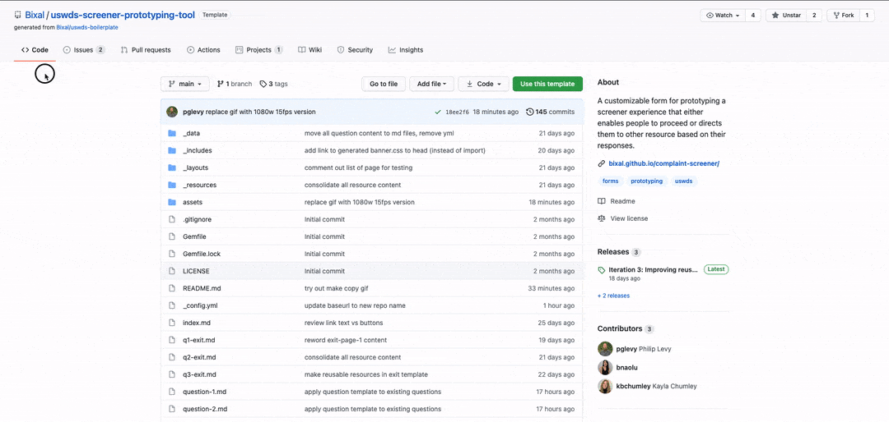

# USWDS Screener Prototyping Tool

At [Bixal](https://www.bixal.com/), we believe fast cycles of prototyping and testing accelerate learning, reduce risk, and improve outcomes. We started a dedicated internal team to explore new processes and tools for using web-based prototyping to help our delivery teams lower the barriers to making ideas more tangible more quickly. With our focus on speed, tangibility, reusability, and openness, we demonstrate what's possible with rapid prototyping, lean research, content libraries, and design frameworks. 

One issue we see commonly across government websites is the need for people to fill out a simple screener form before they continue with a larger task to ensure they understand what’s being asked of them and why. When these screeners are long, onerous, and confusing, they lead to wasted time and bad data. Our goal was to build a template that incorporates best practices for accessibility, plain language, and usability to make it quick and easy to test different versions.

## Features

- **Custom questions**: Set up any number of questions with their own answer text, related resources, and pathing based on responses. (Radio buttons only for now.)
- **Simple logic flow**: For each answer, direct people to the next question, an exit page, or jump ahead to the success page.
- **Linked resources**: Each question and exit page can include resource content stored in its own plain-text pages.
- **Step indicator**: Show people where they are in the process, even if you're not building the whole thing.
- **No code**: Most customization can be done by creating and editing plain-text files. No need to mess with code for the included features.
- **U.S. Web Design System**: Built on [USWDS](https://designsystem.digital.gov/) for the best in accessible, responsive, usable web experiences for government-focused sites.

## Content types

The screener includes the following content types:

- **Home**: The starting page to set context for your screener ([index.md](index.md)).
- **Question**: A single-question page template ([question-1.md](question-1.md)).
- **Exit**: Pages to direct people who filter out of the screener based on their responses ([q1-exit.md](q1-exit.md)).
- **Success**: The final page for people who have made it through the screener ([success.md](success.md)).

## Flow map

This is how the basic logic flow works:

## How to

### Speak GitHub

GitHub uses some different language to describe things and actions you're probably already familiar with. See this handy [GitHub Glossary](https://github.com/Bixal/methods/wiki/GitHub-glossary) if you're not sure about some of the terms used in these instructions.

### Make your own copy of the repository

1. If you don't have one, [create a GitHub account](https://github.com/signup).
1. On the `Code` tab of the repository homepage, press the `Use this template` button.
1. Finish creating your copy of the repository.

### Go live using GitHub Pages

GitHub Pages will compile and host your site automatically. Enable this feature first so you can see your changes in the browser without having to run the site locally.

> **Note: It takes a few seconds to a minutes to go live, so the first time you go to the site, you may see a "404: Page Not Found" error. After it's live, you should see any changes you make to the `main` branch at the Pages URL, usually within a few seconds.**

1. Go to the `Settings` tab.
1. Go to `Pages` in the side navigation.
1. In the `Source` section, set the branch to `main` and press Save.

> *Tip*: Copy the Pages URL and add it to your repository About section for easy access. The About section is on in the sidebar of the repository homepage. To edit it, click the gear icon. You can also see the log of publishing activity by pressing the `Environments` link in the sidebar on the repository homepage.

### Configure settings

You'll need to change a few settings in the config file for your site to work properly.

1. Go to the [_config.yml](_config.yml) file in your repository.
1. Press the `Edit this file` button (pencil icon).
1. Make changes to following settings:
    - Title: The title of the site that shows up in the browser tab and on the homepage.
    - Description: The description that shows up on the homepage and also the meta description for search engine optimization.
    - Baseurl: *This needs to match the name of your repository for internal links to work.*
1. Save your changes by pressing the `Commit changes` button.

### Edit questions

1. Click on a question file in the `Code` tab, for example, [question-1.md](question-1.md).
1. Press the `Edit this file` button (pencil icon).
1. Make changes to the question `text` and `answers` content as desired.
1. You can also change some navigation settings, like what page the back button for the question goes to, if needed.
1. Save your changes by pressing the `Commit changes` button.

> *Tip*: Add a short description about the change you made before committing.

### Edit rich text content

Content for the homepage, exit pages, and resource pages is stored in Markdown format. This is a simple way to structure and format content that is both human- and machine-readable.

See the GitHub Guide, [Mastering Markdown](https://guides.github.com/features/mastering-markdown/) for a reference on how to format content.

You can open, edit, and save these pages the same way as described in [Edit questions](#edit-questions) above.

### Change the homepage image

You can use an absolute link to an existing image. Or you can upload an image to the repository and use a relative link.

> *Tip*: Make sure your filename…
> - doesn't have any spaces.
> - doesn't start with a period (`.`) or an underscore (`_`).

1. If you're uploading an image, go to [/assets/img](/assets/img) in your repository.
1. Press the `Add file` button and choose `Upload files`.
1. Save your changes by pressing the `Commit changes` button.
1. Go to the [_config.yml](_config.yml) file in your repository.
1. Update the `homepage-image` setting to "../img" and the new filename.
    - Make sure the name you put in the config file matches the filename you uploaded.
    - If you're using an image hosted somewhere else, replace everything in quotes with the full URL, for example, `https://mysite.com/my-image.jpg`.

### Create new content

1. On the `Code` tab of the repository homepage, press the `Add file` button.
1. Upload a markdown file (.md) or create one in the browser.
1. If you create one, name the file similar to the existing ones for that content type, and make sure it's in the same place by setting file path to match.

### Link resources content

One or more sections of resource content can be added to question and exit pages. Each one appears as a collapsible accordion component.

1. Create a new file in markdown (.md) format in the [_resources](_resources) folder.
1. For the `related-page-name` setting, enter the filename of the page you want the resource to appear on, for example, `q2-exit.md`.
1. On the related page, enter `yes` for the `resources` setting.

This creates the link between the two pieces of content and will result in the resources showing up on that page.

> *Tip*: To sort the resources in the particular order, prepend numbers to the resources filename. This only affects resources that appear on the same page, so you don't have to worry about numbering everything.

## Team

This project was built by the Rapid Response Team at Bixal: [Philip Levy](https://github.com/pglevy), [Brianna Naolu](https://github.com/bnaolu), and [Kayla Chumley](https://github.com/kbchumley), with a special guest appearance by [Emilia Nardi](https://github.com/orgs/Bixal/people/e-nardi) for subject matter expertise and UX support.

## Credit and license
This project was created using the [GitHub Pages gem for Jekyll](https://github.com/github/pages-gem) and a hosted version of the [U.S. Web Design System](https://github.com/uswds/uswds) on [CDNJS](https://cdnjs.com/). The content for this tool is based on an improved version of the [Complaint Portal Assistant](https://ocrportal.hhs.gov/ocr/smartscreen/main.jsf) from the Office of Civil Rights at the U.S. Department of Health & Human Services. Photo by [National Cancer Institute](https://unsplash.com/@nci?utm_source=unsplash&utm_medium=referral&utm_content=creditCopyText) on [Unsplash](https://unsplash.com/?utm_source=unsplash&utm_medium=referral&utm_content=creditCopyText).

This project is licensed under [The Unlicense](https://github.com/Bixal/uswds-template/blob/main/LICENSE), which allows everything and promises nothing. 🌊
